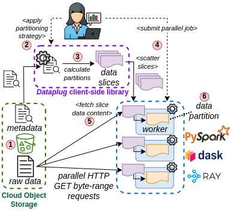

# Dataplug: Unstructured Scientific Data Partitioning for Cloud-Native Workloads

**Dataplug is a client-side only, extensible, Python framework with the goal of enabling efficient data partitioning of unstructured scientific data stored in object storage (like Amazon S3) for elastic workloads in the Cloud**

- Dataplug provides a **plug-in interface to enable data partitioning to a multitude of scientific data types, from a variety of domains, stored in S3**.  Currently, Dataplug supports the following data types:

  - Generic
      - [CSV](docs/formats/generic/csv.md)
      - [Raw Text](docs/formats/generic/rawtext.md)
  - Genomics
      - [FASTA](docs/formats/genomics/FASTA.md)
      - [FASTQ](docs/formats/genomics/FASTQ.md)
      - [VCF](docs/formats/genomics/VCF.md)
  - Geospatial
      - [LiDAR](docs/formats/geospatial/lidar.md)
      - [Cloud-Optimized Point Cloud](docs/formats/geospatial/copc.md)
  - Metabolomics
      - [ImzML](docs/formats/metabolomics/imzml.md) 

- Dataplug follows a **read-only cloud-aware pre-processing** approach to enable **on-the-fly dynamic partitioning of scientific unstructured data**.
  - It is **cloud-aware** because it specifically targets cold raw data residing in huge repositories in object storage (e.g. Amazon S3).
    S3 allows partial reads at high bandwidth by using HTTP GET Byte-range requests.
    Dataplug builds indexes around this premise to enable parallel chunked access to unstructured data.
    It compensates high latency of object storage with many parallel reads at high bandwidth.
  - It is **Read-only** because, in object storage, objects are immutable.
    Thus, pre-processing is read-only, meaning that index and metadata are stored decoupled from data, in another object.
    Raw cold data is kept as-is in storage. This voids to re-write the entire dataset for partitioning.
    Since indexes are several orders of magnitude smaller, the data movements are considerably reduced.

- Dataplug allows **re-partitioning a dataset at zero-cost**.
  - Dataplug introduces the concept of **data slicing**. A *data slice* is a lazily-evaluated partition of a pre-processed dataset in its raw form, present in object storage (1).
  - Users can perform different **partitioning strategies** (2) on the same dataset without actually moving data around (3).
  - *Data slices* are serializable, and can be sent to remote workers using any Python-compatible distributed computing environment (4) (e.g. PySpark, Dask or Ray).
  - *Data slices* are evaluated at the moment of accessing the data, and not before (5). This allows many remote workers to perform many HTTP GET Byte-range requests in parallel onto the raw dataset, exploiting S3's high bandwidth capabilities.



## Installation

- Dataplug is only available through GitHub. You can use `pip` to install it directly from the repository:

    ```bash
    pip install git+https://github.com/CLOUDLAB-URV/dataplug
    ```


### Partitioning text example

```python
from dataplug import CloudObject
from dataplug.formats.genomics.fastq import FASTQGZip, partition_reads_batches

# Assign FASTQGZip data type for object in s3://genomics/SRR6052133_1.fastq.gz
co = CloudObject.from_s3(FASTQGZip, "s3://genomics/SRR6052133_1.fastq.gz")

# Data must be pre-processed first ==> This only needs to be done once per dataset
# Preprocessing will create reusable indexes to repartition
# the data many times in many chunk sizes
# Dataplug leverages joblib to deploy preprocessing jobs
co.preprocess(parallel_config={"backend": "dask"})

# Partition the FASTQGZip object into 200 chunks
# This does not move data around, it only creates data slices from the indexes
data_slices = co.partition(partition_reads_batches, num_batches=200)

def process_fastq_data(data_slice):
    # Evaluate the data_slice, which will perform the
    # actual HTTP GET requests to get the FASTQ partition data
    fastq_reads = data_slice.get()
    ...

# Use Dask for deploying a parallel distributed job
import dask.bag as db
from dask.distributed import Client

client = Client()
# Create a Dask Bag from the data_slices list
dask_bag = db.from_sequence(data_slices)

# Apply the process_fastq_data function to each data slice
# Dask will serialize the data_slices and send them to the workers
dask_bag.map(process_fastq_data).compute()
```
## Documentation

- [Dataplug Documentation](docs/README.md)
- [Dataplug API Reference](docs/api.md)
- [Developing new data format plugins](docs/develop-plugins.md)

## Acknowledgements

This project has been partially funded by the EU Horizon programme under grant agreements No. 101086248, No. 101092644, No. 101092646, No. 101093110.


