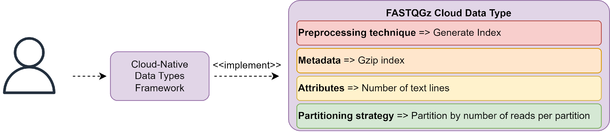
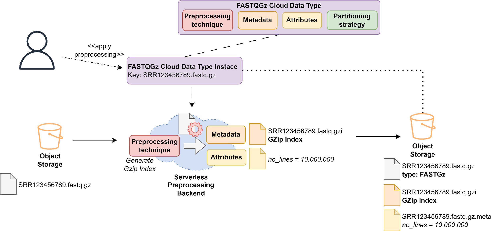
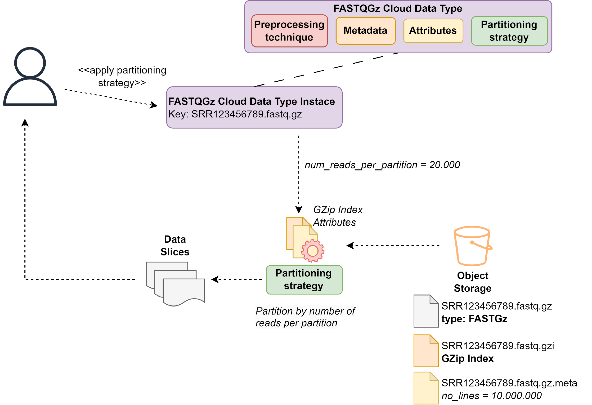

Example application: FASTQGZip partitioning
===========================================

This page describes a full example of `Dataplug` functionality for the ``FASTQGZip`` Cloud-native data type.

Pre-processing
--------------

With `Dataplug`, users can define and implement *Cloud-Native data types* as Python classes decorated with
``CloudDataType``, where we define the associated pre-processor and the type hierarchy.

   Workflow step 1: Create a new Cloud-native data type

.. code-block:: python

    @CloudDataType(preprocessor=GZipPreprocessor)
    class FASTQGZip:
      number_of_sequences: int
      experiment_id: str
      ...  # additional attributes

In the code above we can see an example where we define a new *Cloud-native data type* for ``FASTQGZip`` data. We can
define multiple attributes, in this case, the number of genome sequences and experiment id.

.. code-block:: python

    class GZipPreprocessor(BatchPreprocessor):
      @staticmethod
      def preprocess(self, cloud_object: CloudObject,
          experiment_id: str):
        stream = cloud_object.s3.get_object()
        # process 'stream' to generate index using gztool
        n_lines, index = generate_gzip_index(stream)
        n_sequences = no_lines // 4
        return PreprocessingMetadata(
          attributes={'number_of_sequences': no_sequences,
                      'experiment_id': experiment_id},
          metadata=index)

Following the example, in the code above we see the implementation of a *batch* type pre-processor for the ``FASTQGZip``
*Cloud-native data type*. `gztool <https://github.com/circulosmeos/gztool>`_ is used to generate a GZip index.

We can now reference an object stored in S3 using its full URI location (``s3://my_bucket/SRR123456.fastqgz``), assign
it the ``FASTQGZip`` *Cloud-native data type*, and apply the corresponding pre-processing using the
``AWSEC2Preprocesor`` backend.

.. code-block:: python

    # Create Cloud Object reference
    co = CloudObject.from_s3(FASTQGZip,
                             's3://my_bucket/SRR123456.fastqgz')

.. figure:: images/fastqgz-step2.png
   :align: center
   :alt: Workflow step 2: Assign a Cloud-native data type to a object stored in S3

   Workflow step 2: Assign a Cloud-native data type to a object stored in S3

.. code-block:: python

    # Preprocess object (this has to be done only once)
    backend = AWSEC2Preprocessor()
    co.preprocess(backend, sequence_identifier='SRR0000000')

   Workflow step 3: Apply partitioning strategy and generate data slices

Partitioning
------------

Next, we need to implement a *partitioning strategy* for the ``FASTQGZip`` Cloud-native data type.

.. code-block:: python

    def partition_num_reads(cloud_object: FASTQGZip,
        num_seq_partition: int) -> List[FASTQGZipTextSlice]:
      # Split by number of reads per worker
      # (each read is composed of 4 lines)
      n_lines = cloud_object["number_of_sequences"] * 4
      n_parts = (num_seq_partition * 4) // n_lines
      lpp = ceil(n_lines / n_parts) # lines per partition
      linepairs = [((lpp * i) + 1, (lpp * i) + lpp + 1)
                   for i in range(n_parts)]
      byteranges = get_byteranges(cloud_object.metadata, linepairs)
      return [FASTQGZipTextSlice(range_0, range_1)
              for (range_0, range_1) in byteranges]

The code above implements partition strategy that calculates the offsets of the GZip file entry points for each
partition, based on the number of lines per partition. Other strategies can be implemented, for example, to partition
by total number of chunks, regardless of the chunk size. Pre-processing strategy functions can access attributes and
metadata generated in the pre-processing phase. In this case, we utilize the GZip index generated earlier to calculate the necessary offsets.

The result of this function is a list of *GZipTextSlice*, which embeds in each *data slice* the necessary metadata
to later retrieve the data chunk:

.. code-block:: python

    class GZipTextSlice(CloudObjectSlice):
      def get(self):
        index = self.cloud_object.metadata
        byterange = f'bytes={self.range_0}-{range_1}'
        stream = self.s3.get_object(Range=byterange)
        lines = (self.line_0, self.line_1)
        chunk = decompress_gzip(stream, index, lines=lines)
        return chunk

Each worker of the distributed computing framework will receive an instance of the ``GZipTextSlice`` classe, one for
each slice generated in the partitioning strategy. The `get()` method will be called by the application user code,
which evaluates the *data slice* to perform a byte-range GET request to object storage with the specified range,
and, using the index, it finally returns the specified decompressed chunk of the ``FASTQGZip`` file.

We can now apply the partitioning strategy and create *data slices*:

.. code-block:: python

    # Apply partition strategy and get slices
    data_slices = co.partition(partition_num_reads,
                               num_seq_partition=1_000_000)

   Workflow step 4: Apply partitioning strategy and generate data slices

.. code-block:: python

    # Define processing function
    def process_sequences(data_slice: GZipTextSlice):
      chunk = data_slice.get()
      ...  # process fastq chunk
      return result

    # Submit parallel serverless job with ipyparallel
    # with data slices as input data
    with ipyparallel.Cluster() as cluster:
      view = cluster.load_balanced_view()
      result = view.map(process_sequences, data_slices)

.. figure:: images/fastqgz-step5.png
   :align: center
   :alt: Workflow step 5: Scatter data slices and consume partitions in parallel from many distributed workers

   Workflow step 5: Scatter data slices and consume partitions in parallel from many distributed workers

